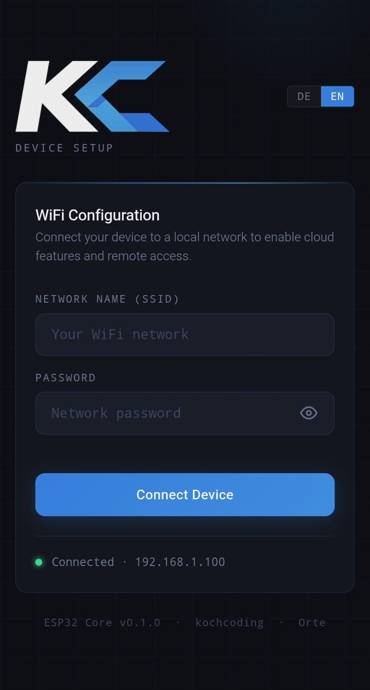
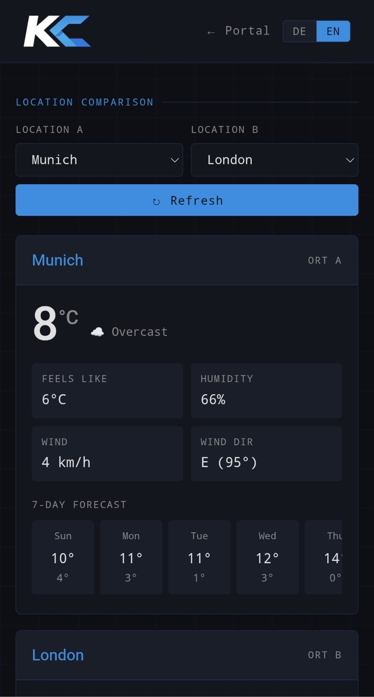

<picture>
  <source media="(prefers-color-scheme: dark)" srcset="docs/logo/horizontalDark.svg">
  <source media="(prefers-color-scheme: light)" srcset="docs/logo/horizontalLight.svg">
  
</picture>

---

[](https://github.com/kochcoding/esp32-firmware-core/actions/workflows/ci.yml)
[](https://github.com/kochcoding/esp32-firmware-core/actions/workflows/ci.yml)
[](https://github.com/kochcoding/esp32-firmware-core/releases/latest)
[](LICENSE)

# esp32-firmware-core

> Production-quality ESP32 firmware for a WiFi-connected weather station.
> Built with ESP-IDF 5.5.0, plain C, and professional embedded coding standards.

This project demonstrates a complete embedded firmware system — from low-level WiFi management
and HTTP server infrastructure to a browser-based configuration UI and external REST API
integration. It is designed to serve as a reference for professional embedded systems
development on the ESP32 platform.

---

## Web UI

<table>
  <tr>
    <td align="center"><b>Captive Portal / WiFi Setup</b></td>
    <td align="center"><b>Weather & Locations</b></td>
  </tr>
  <tr>
    <td></td>
    <td></td>
  </tr>
</table>

> Screenshots taken on mobile. Both views are accessible from any device on the same network.

---

## What It Does

On first boot the device starts as a WiFi Access Point and serves a **captive portal** —
the user connects to the AP, is redirected to the configuration UI in their browser,
and enters their WiFi credentials. From that point the device operates in **APSTA mode**:
the AP stays active while the STA interface connects to the home network.

Once connected, the firmware fetches current weather data from the
[Open-Meteo API](https://open-meteo.com/) for one or more configured locations and
makes it available through a clean REST API.

```
First Boot                      Normal Operation
──────────────────              ──────────────────────────────────────────
ESP32 starts AP         →       ESP32 in APSTA mode
User connects to AP     →       STA connected to home network
Browser opens portal    →       HTTP server serves REST API + Web UI
User enters WiFi creds  →       Weather data fetched from Open-Meteo
Credentials saved to NVS→       Locations managed via browser UI
```

---

## Feature Overview

| Feature | Description |
|---|---|
| Captive Portal | Automatic browser redirect on first connect |
| WiFi Configuration | Enter SSID and password via browser UI |
| Connection Status | Live STA state and assigned IP address |
| Location Management | Add and remove weather locations via browser UI |
| Weather Data | Current conditions fetched from Open-Meteo |
| NVS Persistence | WiFi credentials and locations survive reboots |
| APSTA Mode | AP and STA run simultaneously — no connectivity gap |
| Retry Logic | Exponential backoff reconnect (1 s … 10 s, max 10 retries) |

---

## Architecture

The codebase is organized into four layers with clear separation of concerns:

```
┌─────────────────────────────────────────────────────┐
│                    Web UI (Browser)                  │
└──────────────────────────┬──────────────────────────┘
                           │ HTTP
┌──────────────────────────▼──────────────────────────┐
│               HTTP Server + REST Routes              │
│  /api/wifi   /api/locations   /api/weather           │
│  /api/geocode                 / (portal + UI pages)  │
└──────┬──────────────┬────────────────┬───────────────┘
       │              │                │
┌──────▼──────┐ ┌─────▼──────┐ ┌──────▼──────────────┐
│  WiFi Stack │ │  Domain +  │ │   Open-Meteo Client  │
│  AP + STA   │ │  Storage   │ │   (HTTP + JSON)      │
│  DNS Hijack │ │  NVS + cJSON│ └─────────────────────┘
└─────────────┘ └────────────┘
```

### Module Overview

| Module | Responsibility |
|---|---|
| `wifi_ap` | Initialises SoftAP, DHCP, APSTA mode |
| `wifi_sta` | STA state machine, retry/backoff, IP management |
| `dns_hijack` | UDP DNS server — redirects all queries to AP IP (captive portal) |
| `http_server` | ESP-IDF HTTP server setup and route registration |
| `routes_api_wifi` | REST endpoints for WiFi status and connect |
| `routes_api_locations` | REST endpoints for location CRUD |
| `routes_api_weather` | REST endpoint serving cached weather JSON |
| `routes_api_geocode` | REST endpoint for location geocoding |
| `routes_portal` | Serves the browser UI pages and handles unknown paths |
| `openmeteo_client` | HTTP client fetching weather data from Open-Meteo |
| `app_settings_persistence` | Load/save WiFi credentials via NVS |
| `app_locations_persistence` | Load/save location list via NVS |
| `domain/locations_model` | In-memory location list with invariant enforcement |
| `storage/locations_storage` | JSON serialisation for location persistence |
| `storage/settings_storage` | JSON serialisation for WiFi settings |
| `storage/weather_storage` | JSON validation and compaction for weather cache |

---

## Tech Stack

| Component | Technology |
|---|---|
| MCU | ESP32 (Xtensa LX6, 240 MHz, 4 MB Flash) |
| Framework | ESP-IDF 5.5.0 |
| Build System | PlatformIO |
| Language | C (C11) |
| JSON | cJSON 1.7.18 |
| Unit Tests | Unity (native environment) |
| CI | GitHub Actions |

---

## Project Structure

```
esp32-firmware-core/
├── include/                  # Public headers
│   ├── app/                  # Application-layer headers
│   ├── http/                 # HTTP server and route headers
│   ├── ui/                   # UI asset and route headers
│   ├── core_config.h         # Kconfig abstraction layer
│   ├── dns_hijack.h
│   ├── openmeteo_client.h
│   ├── wifi_ap.h
│   └── wifi_sta.h
├── src/                      # Implementation
│   ├── app/                  # NVS persistence layer
│   ├── http/                 # HTTP server and all routes
│   ├── ui/                   # UI assets and routes
│   ├── dns_hijack.c
│   ├── main.c
│   ├── openmeteo_client.c
│   ├── wifi_ap.c
│   └── wifi_sta.c
├── lib/                      # Internal PlatformIO libraries
│   ├── domain/               # Location model (include + src)
│   └── storage/              # JSON serialisation layer (include + src)
├── test/                     # Native unit tests (Unity)
├── docs/                     # Documentation and assets
│   ├── testing_native_setup_windows.md
│   ├── horizontalDark.svg
│   └── horizontalLight.svg
├── .github/workflows/
│   └── ci.yml                # Build + unit test pipeline
├── platformio.ini
└── sdkconfig.defaults
```

---

## CI Pipeline

Every push runs a two-stage GitHub Actions pipeline:

```
unit-test  →  build (only if tests pass)
```

The `unit-test` job compiles and runs all Unity tests in a native Linux environment —
no hardware required. The `build` job cross-compiles the full firmware for `esp32dev`.
A `firmware.bin` artifact is uploaded automatically on `main` and version tags (`v*`).

Current pipeline status: [](https://github.com/kochcoding/esp32-firmware-core/actions/workflows/ci.yml)

---

## Getting Started

### Prerequisites

- [PlatformIO Core](https://docs.platformio.org/en/latest/core/installation/index.html)
- Python 3.11+

### Build

```bash
git clone https://github.com/kochcoding/esp32-firmware-core.git
cd esp32-firmware-core
pio run -e esp32dev
```

### Flash

```bash
pio run -e esp32dev --target upload
```

### Run Unit Tests (native, no hardware needed)

```bash
pio test -e native
```

For Windows-specific setup (MSYS2/GCC toolchain), see
[docs/testing_native_setup_windows.md](docs/testing_native_setup_windows.md).

---

## Coding Standards

This codebase is written to a professional embedded standard suitable for
safety-adjacent applications:

- **Defensive programming** — every pointer is checked before use, every return value
  is handled, no silent failures
- **Doxygen throughout** — `@file`, `@brief`, `@param`, `@retval` on every function
- **Named constants** — no magic numbers anywhere in the codebase
- **Explicit style** — no implicit boolean conversions, braces on all control structures,
  `/* */` comments only
- **Section structure** — every `.c` file follows the same layout:
  includes → defines → typedefs → variables → prototypes → implementation → public API

---

## License

MIT License — see [LICENSE](LICENSE) for details.

---

*Built by [Lukas Koch](https://kochcoding.com) — Embedded Firmware Developer*
